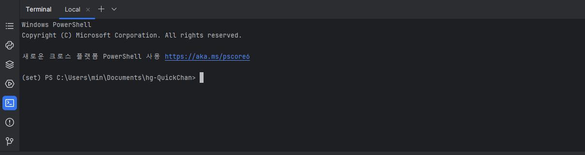
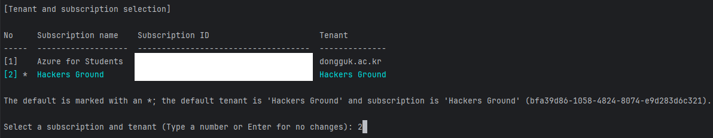
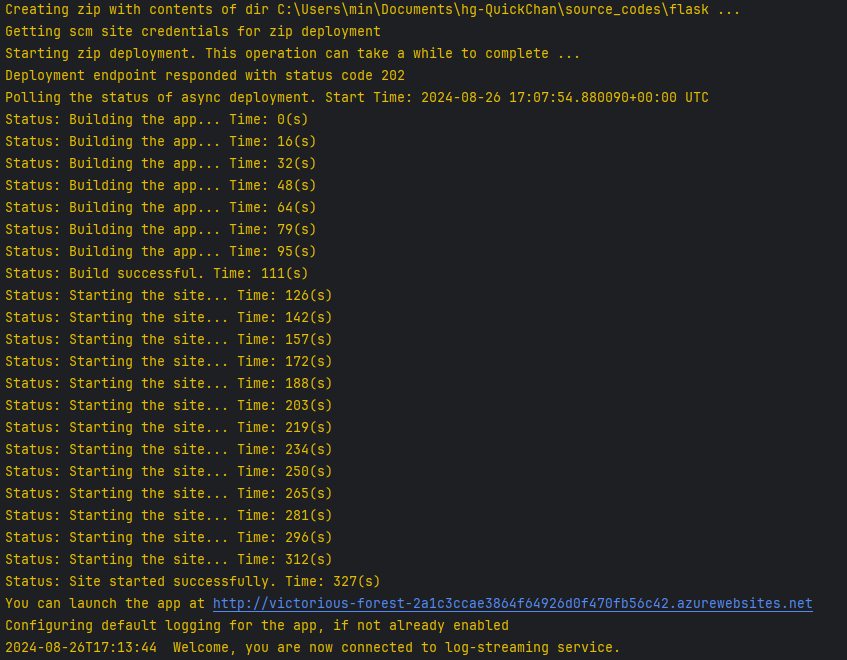

# 퀵찬 - 시니어를 위한 길 안내 서비스 '부릉'

해커그라운드 해커톤에 참여하는 `퀵찬` 팀의 서비스 `부릉` 입니다.

## 참고 문서

> 아래 두 링크는 해커톤에서 앱을 개발하면서 참고할 만한 문서들입니다.  
 이 문서들에서 언급한 서비스 이외에도 더 많은 서비스들이 PaaS, SaaS, 서버리스 형태로 제공되니 참고하세요.

- [순한맛](./REFERENCES_BASIC.md)
- [매운맛](./REFERENCES_ADVANCED.md)

## 제품/서비스 소개

<!-- 아래 링크는 지우지 마세요 -->
[제품/서비스 소개 보기](TOPIC.md)
<!-- 위 링크는 지우지 마세요 -->


## 오픈 소스 라이센스

<!-- 아래 링크는 지우지 마세요 -->
[오픈소스 라이센스 보기](./LICENSE)
<!-- 위 링크는 지우지 마세요 -->

## 설치 방법

> **아래 제공하는 설치 방법을 통해 심사위원단이 여러분의 제품/서비스를 실제 Microsoft 애저 클라우드에 배포하고 설치할 수 있어야 합니다.  
 만약 아래 설치 방법대로 따라해서 배포 및 설치가 되지 않을 경우 본선에 진출할 수 없습니다.**

### 공통 준비 사항
[vscode](https://code.visualstudio.com/download), [pycharm](https://www.jetbrains.com/help/pycharm/installation-guide.html), [IntelliJ](https://www.jetbrains.com/ko-kr/idea/) 등 IDE를 준비합니다.

[프로젝트 다운로드](https://github.com/hackersground-kr/hg-QuickChan/archive/refs/heads/main.zip)
및 압축해제를 진행합니다.

이후 프로젝트를 IDE 에서 열어줍니다.
Downloads\hg-QuickChan-main 에 위치합니다.

이후 하단 터미널을 열어줍니다.


<details>
<summary><span style="font-size: 1.5em;">for 윈도우</span></summary>
<div markdown="1">

```git
az --version
```
버전이 출력된다면 아래 CLI 설치를 넘겨도 됩니다.

### 사전 준비 사항
https://learn.microsoft.com/en-us/cli/azure/install-azure-cli-windows?tabs=azure-cli

애저 CLI 설치
(설치 이후 IDE를 재시작 해주세요)


```git
az --version
```
이후 설치 확인


```git
cd ./source_codes/flask
```
백엔드 폴더로 이동(프로젝트 폴더 내에서 이동)


# 시작하기

```git
az login
```
애저 CLI를 통해서 로그인 진행


자신에게 해당하는 계정을 선택하면 됩니다.



```
az webapp up --runtime PYTHON:3.9 --sku B1 --logs --resource-group {"자신의 리소스 그룹 이름"} --location KoreaCentral
```
{"자신의 리소스 그룹 이름"} 을 알맞게 변경해주세요.
ㅤ
<details>
<summary>오류가 발생할 경우</summary>
<div markdown="1">
속도가 느린 인터넷을 사용하여 접속한다면 Time Out에 빠질 수 있습니다.      

혹은
```
az upgrade
az cloud update --skip-ssl-validation
```
애저 CLI업데이트 및 SSL 인증서를 비활성화하여 실행 가능합니다.
</div>
</details>



http://<app-name>.azurewebsites.net 에 접속하여 페이지가 나온다면 성공.
</div>
</details>


<details>
<summary><span style="font-size: 1.5em;">for macOS</span></summary>
<div markdown="1">

### 사전 준비 사항

#### 1. Homebrew 설치

Homebrew는 macOS용 패키지 관리자입니다. 아직 설치하지 않았다면, 터미널을 열고 다음 명령어를 실행하여 Homebrew를 설치합니다:

```
brew --version
```
brew버전 확인 입니다. 설치가 되어 있다면 Azure CLI로 넘어가면 됩니다

```
 /bin/bash -c "$(curl -fsSL https://raw.githubusercontent.com/Homebrew/install/HEAD/install.sh)"
```
Homebrew 설치가 완료되면, 설치가 정상적으로 되었는지 확인합니다:


```
brew --version
```

----------------------
### 2. Azure CLI 설치

```
brew update
brew install azure-cli
```
Homebrew를 사용하여 Azure CLI를 설치합니다:


```
az --version
```
설치 후 Azure CLI 버전을 확인하여 올바르게 설치되었는지 확인합니다:


```
cd ./source_codes/flask
```
Flask 백엔드 폴더로 이동합니다.
REPOSITORY_ROOT/source_codes/flask 으로 이동

# 시작하기

```
az login
```
Azure CLI를 사용하여 Azure에 로그인합니다.


자신에게 해당하는 계정을 선택하면 됩니다.


로그인이 완료되면 애플리케이션을 배포합니다.


```
az webapp up --runtime PYTHON:3.9 --sku B1 --logs --resource-group {"자신의 리소스 그룹 이름"} --location KoreaCentral
```
위 명령어에서 {"자신의 리소스 그룹 이름"}을 자신의 리소스 그룹 이름으로 변경해주세요.

<details> <summary>오류가 발생할 경우</summary> <div markdown="1">
인터넷 속도가 느리면 Time Out 오류가 발생할 수 있습니다.

또는 다른 오류가 발생할 수 있습니다.
다음 명령어로 문제를 해결할 수 있습니다:

```
az upgrade
az cloud update --skip-ssl-validation
```
위 명령어는 Azure CLI를 업데이트하고 SSL 인증서 검증을 비활성화하여 실행합니다.

</div> </details>

애플리케이션이 성공적으로 배포되었는지 확인하려면, 
http://<app-name>.azurewebsites.net 에 접속하여 웹 페이지가 제대로 표시되는지 확인합니다.

</div> </details> 


<details>
<summary><span style="font-size: 1.5em;">for Linux</span></summary>
<div markdown="1">
TODO
</div>
</details>
